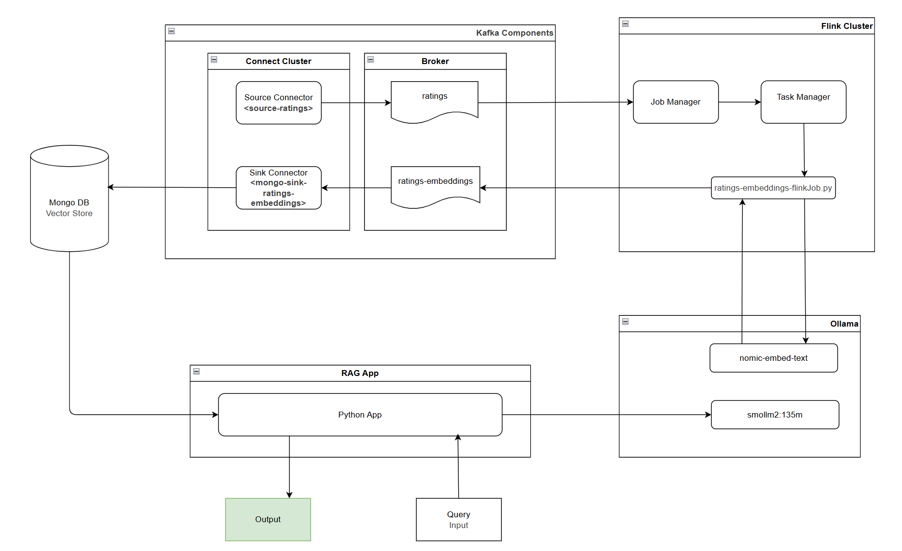

# Streaming RAG Application with Apache Flink

A demonstration of a Retrieval-Augmented Generation (RAG) application built on streaming data using Apache Flink, Kafka, MongoDB, and Ollama.

## Overview

This project showcases a real-time RAG system that processes streaming data rather than traditional batch processing. The system ingests data from Kafka topics, enriches it with vector embeddings using Flink, stores it in MongoDB as a vector database, and enables semantic search capabilities through a Python-based RAG application.

### Key Technologies

- **Apache Flink** - Stream processing engine
- **Apache Kafka** - Distributed event streaming platform
- **Kafka Connect** - Data integration framework with DataGen and MongoDB connectors
- **MongoDB** - Vector store and search database
- **Ollama** - Local hosting for embedding (`nomic-embed-text`) and LLM models (`smollm2:135m`)
- **Python** - RAG application interface

## Architecture



### System Flow

1. **Data Generation**: Dummy rating data is generated on the `ratings` topic using the Kafka Connect DataGen Connector
2. **Stream Processing**: Flink processes incoming messages and generates embeddings using the `nomic-embed-text` model from Ollama
3. **Data Enrichment**: Processed data with vector embeddings is written to the `ratings-embeddings` topic
4. **Data Persistence**: MongoDB Sink Connector streams data from `ratings-embeddings` into MongoDB
5. **RAG Query**: Python application queries the MongoDB vector store for context-aware responses

## Prerequisites

Before getting started, ensure you have the following installed:

- **Docker Desktop** - Container runtime environment
- **Python 3.0+** - Programming language runtime
- **MongoDB Compass** - MongoDB GUI ([Download here](https://www.mongodb.com/try/download/compass))
- **System Resources**:
  - Minimum 5GB available RAM
  - Adequate disk space for Docker images and containers

## Getting Started

### 1. Infrastructure Setup

Start the Docker infrastructure:

```bash
# Ensure Docker Desktop is running
docker compose up -d --build
```

> **Note**: Initial setup may take several minutes to download images and start all services.

### 2. Validate MongoDB Connection

Verify MongoDB is running and accessible:

1. Open **MongoDB Compass**
2. Create a new connection with the following connection string:
   ```
   mongodb://127.0.0.1:27017/?directConnection=true&serverSelectionTimeoutMS=2000&appName=mongosh+2.5.10
   ```
3. No authentication is required for local development
4. After connecting, verify that the **search indexes** are present

### 3. Validate Kafka Connect Services

Check the status of Kafka Connect connectors:

```bash
# Check source connector status
curl http://localhost:8083/connectors/source-ratings/status

# Check MongoDB sink connector status
curl http://localhost:8083/connectors/mongo-sink-ratings-embeddings/status
```

Both connectors should show `RUNNING` status.

### 4. Submit Flink Job

Deploy the stream processing job:

```bash
# Access the Flink JobManager container
docker exec -it jobmanager bash

# Submit the Flink job
flink run -d -py FlinkJobs/ratings-embeddings-flinkJob.py
```

#### Monitor Flink Job

- Access the Flink Web UI at [http://localhost:8081](http://localhost:8081)
- Verify the job status is `RUNNING`
- If the job fails on first submission, resubmit the job
- Check MongoDB Compass to confirm data is being written to the collection

### 5. Run the RAG Application

#### Setup Python Environment

```bash
# Create virtual environment
python -m venv .venv-streamingrag

# Activate virtual environment
# Windows:
.\.venv-streamingrag\Scripts\activate
# macOS/Linux:
source .venv-streamingrag/bin/activate

# Install dependencies
pip install -r requirements.txt
```

#### Execute RAG Application

```bash
# Run the application
python RAGApp/ragApp.py

# Enter your query at the prompt
# Example: "What are comments on peanuts?"
```

> **Performance Note**: Response times may be longer than expected due to local model constraints and limited compute resources. Accuracy may vary based on the quality and quantity of embeddings in the vector store.

## Project Structure

```
STREAMINGRAG/
├── .venv-streamingrag/             # Python virtual environment
├── Docker/
│   ├── connect-cluster/
│   │   ├── Dockerfile              # Kafka Connect service configuration
│   │   └── connectors.sh           # Kafka Connect connector configurations
│   ├── flink/
│   │   ├── Dockerfile              # Flink service configuration
│   │   └── requirements.txt        # Flink Python dependencies
│   ├── mongodb/
│   │   ├── Dockerfile              # MongoDB service configuration
│   │   └── mongo-init.js           # MongoDB initialization script
│   └── ollama/
│       └── Dockerfile              # Ollama service configuration
├── FlinkJobs/
│   └── ratings-embeddings-flinkJob.py  # Flink stream processing job
├── Misc/
│   ├── architectural-diagram.drawio    # System architecture diagram
│   ├── kafka-cli-helper.sh             # Kafka CLI utility scripts
│   └── ratings_sample_data.json        # Sample ratings data format
├── RAGApp/
│   └── ragApp.py                   # RAG query application
├── .gitignore                      # Git ignore rules
├── docker-compose.yml              # Docker services orchestration
├── README.md                       # Project documentation
└── requirements.txt                # Python application dependencies
```

## Troubleshooting

### Common Issues

**Containers not starting**: Ensure Docker Desktop has sufficient resources allocated (minimum 5GB RAM)

**Flink job failing**: Check the Flink logs at http://localhost:8081 and resubmit the job if needed

**No data in MongoDB**: Verify all connectors are in `RUNNING` state and check Kafka topic has data

**Slow RAG responses**: This is expected with local models; consider using a more powerful machine or cloud-hosted models for production use

## Contributing

Contributions are welcome! Please feel free to submit issues or pull requests.

## License

This project is licensed under the MIT License - see below for details.

```
MIT License

Copyright (c) 2025 StreamingRAG

Permission is hereby granted, free of charge, to any person obtaining a copy
of this software and associated documentation files (the "Software"), to deal
in the Software without restriction, including without limitation the rights
to use, copy, modify, merge, publish, distribute, sublicense, and/or sell
copies of the Software, and to permit persons to whom the Software is
furnished to do so, subject to the following conditions:

The above copyright notice and this permission notice shall be included in all
copies or substantial portions of the Software.

THE SOFTWARE IS PROVIDED "AS IS", WITHOUT WARRANTY OF ANY KIND, EXPRESS OR
IMPLIED, INCLUDING BUT NOT LIMITED TO THE WARRANTIES OF MERCHANTABILITY,
FITNESS FOR A PARTICULAR PURPOSE AND NONINFRINGEMENT. IN NO EVENT SHALL THE
AUTHORS OR COPYRIGHT HOLDERS BE LIABLE FOR ANY CLAIM, DAMAGES OR OTHER
LIABILITY, WHETHER IN AN ACTION OF CONTRACT, TORT OR OTHERWISE, ARISING FROM,
OUT OF OR IN CONNECTION WITH THE SOFTWARE OR THE USE OR OTHER DEALINGS IN THE
SOFTWARE.
```

### Third-Party Licenses

This project utilizes various open-source technologies, each governed by their respective licenses:

- **Apache Flink** - Apache License 2.0
- **Apache Kafka** - Apache License 2.0
- **MongoDB** - Server Side Public License (SSPL) / MongoDB Enterprise License
- **Ollama** - MIT License
- **Python and associated libraries** - Various licenses (see individual package licenses)

Please refer to each technology's official documentation for their specific licensing terms and conditions.

## References

- [Apache Flink Documentation](https://flink.apache.org/docs/)
- [Kafka Connect DataGen Connector](https://github.com/confluentinc/kafka-connect-datagen)
- [MongoDB Kafka Sink Connector](https://www.mongodb.com/docs/kafka-connector/current/sink-connector/)
- [Ollama Documentation](https://ollama.ai/)
- [MongoDB RAG Local Tutorial](https://www.mongodb.com/docs/atlas/atlas-vector-search/tutorials/local-rag/?language-no-interface=python&index-creation-method=driver)
- [MongoDB RAG Workshop](https://learn.mongodb.com/courses/rag-with-mongodb)